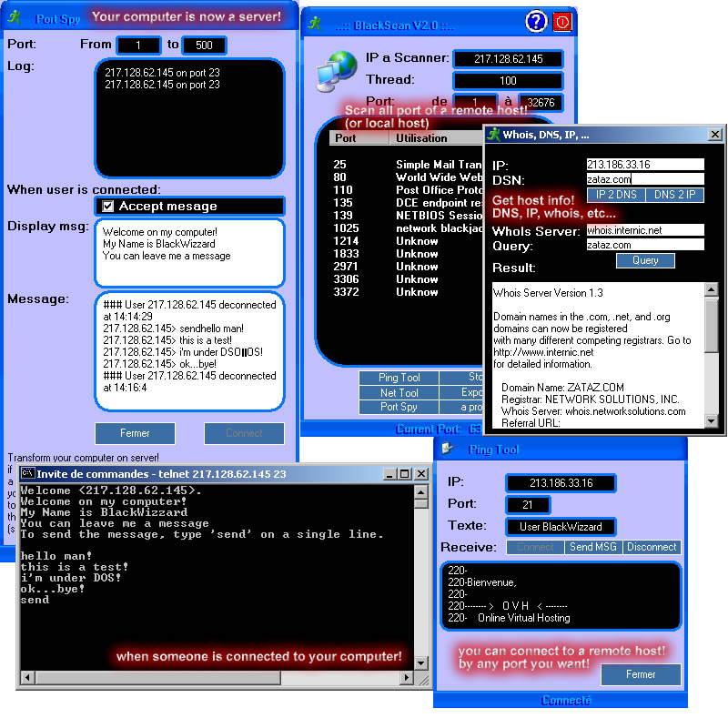



## Complete web app :: Whois, Telnet server & client, PortScanner, DNS 2 IP, etc\.\.\. \#\#\#

### Description

A complet web app :: make your computer a server, WhoIs, DNS 2 IP, IP 2 DNS, port Scanner, Port Spy, all with winsock control! see screenshot for more information! ***Must See*** Please vote if U like!!!
 
### More Info
 

             |
---                |---
**Submitted On**   |2002-01-09 13:19:54
**By**             |[BlackWizzard](https://github.com/Planet-Source-Code/PSCIndex/blob/master/ByAuthor/blackwizzard.md)
**Level**          |Intermediate
**User Rating**    |4.9 (34 globes from 7 users)
**Compatibility**  |VB 5\.0, VB 6\.0
**Category**       |[Internet/ HTML](https://github.com/Planet-Source-Code/PSCIndex/blob/master/ByCategory/internet-html__1-34.md)
**World**          |[Visual Basic](https://github.com/Planet-Source-Code/PSCIndex/blob/master/ByWorld/visual-basic.md)
**Archive File**   |[Complete\_w47386192002\.zip](https://github.com/Planet-Source-Code/blackwizzard-complete-web-app-whois-telnet-server-client-portscanner-dns-2-ip-etc__1-30610/archive/master.zip)

